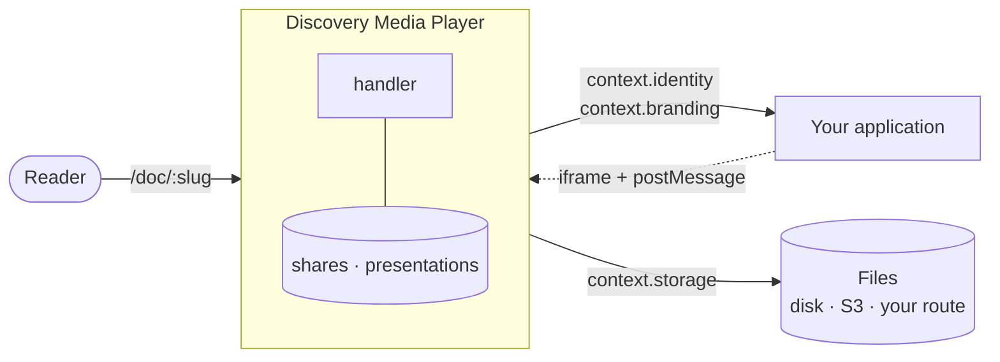

<div align="center">

<picture>
  <source media="(prefers-color-scheme: dark)" srcset="https://raw.githubusercontent.com/Juli1artha/discovery-media-player/main/assets/logo-dark.svg">
  
</picture>

<br><br>

**Send a document. Know if it was read.**

A self-hosted document viewer with per-recipient tracked links, reading analytics,
and live presentation — for teams who would rather not hand their commercial documents
to a third-party SaaS.

[](https://github.com/Juli1artha/discovery-media-player/actions/workflows/ci.yml)
[](https://www.npmjs.com/package/discovery-media-player)
[](https://github.com/Juli1artha/discovery-media-player/pkgs/container/discovery-media-player)
[](package.json)
[](LICENSE)

<br>


<br>

</div>

---

## Try it in two minutes

**[▶ Open the live demo](https://discovery-media-player-demo.vercel.app)** — a document, in the
real viewer, nothing to install.

Or on your own machine, over your own files:

```bash
docker run --rm -p 3000:3000 -v "$PWD/documents:/data" ghcr.io/juli1artha/discovery-media-player
```

Drop a PDF in `./documents` and open `http://localhost:3000`. No database, no account, no
configuration — the viewer, progressive page loading and the reading timer all work from a folder
on disk.


From source, the same thing:

```bash
git clone https://github.com/Juli1artha/discovery-media-player
cd discovery-media-player && npm install
PLAYER_LOCAL_ROOT=./documents npm start
```

That is the whole demo. Tracked links, analytics and live presentation need a database —
see [Going further](#going-further).

---

## Why this exists

Sending a PDF by email tells you nothing. Did they open it? Did they reach the page with the
price? Did they forward it? The products that answer those questions are SaaS: your commercial
documents, your prospects' email addresses and your reading data live on someone else's servers.

This player answers the same questions and runs on your own infrastructure.

|  | What you get |
|---|---|
| **Tracked links** | One link per recipient. Revocable. Re-shares are chained to their parent, so you see when a document travels. |
| **Reading analytics** | Time per page, furthest page reached, device. Counted only while the tab is visible and focused — an open tab in the background is not reading. |
| **Live presentation** | Present a document to a remote audience, with chat, presence, and handover. The audience follows your page without a video call. |
| **Access wall** | Optional: a document can require an email + code before it opens. |
| **Brand per client** | The loader carries your client's logo, resolved at display time — fix a logo and links already in inboxes follow. |
| **Anything on disk** | PDFs and images from a local folder, from S3-compatible storage, or from your own application's file route. |

Two populations are never merged: a prospect reading your proposal and a colleague re-reading
it in-house produce different records. Mixing them makes "this prospect read for 12 minutes"
a lie, which is worse than having no number at all.

### What it displays

| Format | Status | What that means |
|---|:---:|---|
| **PDF** | ✅ | The format the player is built around. Rendered by pdf.js, progressive — the first page shows before the file has finished arriving. Per-page reading time, furthest page reached, page-level presenter sync. |
| **Images** — `.png` `.jpg` `.jpeg` `.webp` `.gif` `.avif` | ✅ | Displayed, zoomable, tracked as a single page. Total reading time is real; there is no per-page breakdown because there are no pages. |
| **Video** | ❌ | Not displayed. A document can *carry* a presenter video during a live presentation, but a video file is not something you can open as a document. |
| **HTML** | ❌ | Deliberately. Displaying arbitrary HTML means executing someone's script in your instance's origin, next to sessions and analytics. The same reason `.svg` is refused. |
| **Office** (`.docx`, `.pptx`, …) | ❌ | Convert to PDF before sending. Nothing in the player renders them, and pretending otherwise would show an empty page. |

An unsupported file is never a security question either. A relayed file opens on the *player's*
origin — the domain holding sessions and analytics — so anything a browser would **render** rather
than download (SVG, HTML, XML) is served inert: generic type, forced download, `nosniff`. It stays
retrievable; it cannot execute.

---

## How it fits your application

The player is a request handler, not a framework. It knows nothing about the application that
hosts it: everything it borrows — storage, database, identity, rate limits, branding, logging —
arrives through a single injected context.



That seam is what lets one codebase serve several products without either of them
forking it. A fix lands once and reaches every instance on its next deploy.

- **Serverless** — `module.exports = require("discovery-media-player").handler`
- **Node / Express / Next.js** — same handler, mounted on a route
- **Standalone** — `npm start`, or the Docker image

It reads `req.query` when the platform provides it (serverless, Express) and falls back to parsing
`req.url` when it does not — so a bare `http.createServer` works too, without a shim.

See [`docs/ARCHITECTURE.md`](docs/ARCHITECTURE.md) for the boundary, and
[`docs/API.md`](docs/API.md) for the surface an integrator implements.

---

## Going further

Tracked links, analytics and live presentation need a Postgres database (Supabase REST for now):

```bash
psql "$DATABASE_URL" -f supabase/init.sql
```

One file, replayable, no migration history to sort through. It installs **already hardened** —
no anonymous read policy is ever created.

Minimum configuration:

| Variable | What it does |
|---|---|
| `PLAYER_LOCAL_ROOT` | serve documents from a folder (the two-minute demo) |
| `SUPABASE_URL`, `SUPABASE_SERVICE_ROLE_KEY` | tracked links, analytics, presentations |
| `PLAYER_BRAND_NAME`, `PLAYER_LOADER_NAME` | your name in the tab title and the loader |
| `PLAYER_SOURCE_URL` | where readers can obtain the source (AGPL, see below) |

Full list: [`docs/CONFIGURATION.md`](docs/CONFIGURATION.md).
Examples you can copy: [`examples/`](examples/).

---

## Security

The file proxy denies by default. It accepts three sources and nothing else: a public object
on an allow-listed storage origin, one explicitly configured route of your own application,
or a file under a configured local root. No credentials in URLs, no redirect following into
your private network.

Found a hole? [`SECURITY.md`](SECURITY.md) — please do not open a public issue.

---

## Licence

**AGPL-3.0-or-later** ([`LICENSE`](LICENSE)). It carries an obligation most licences do not:
if you run a modified version and people read documents through it over a network, they must be
able to obtain your source. Set `PLAYER_SOURCE_URL` to where yours lives — the pages served
link to it.

**The name and the logo are not covered by it.** `assets/` and the words *Discovery Media
Player* are trademarks of 3D Discovery: fork the code freely, but call your fork something else.
This is the usual arrangement in open source, and it protects you as much as us — nobody should
be able to publish something under this name that we did not write.

One exception, on purpose: **[`src/bridge.ts`](src/bridge.ts) is MIT**
([`LICENSE-MIT`](LICENSE-MIT)). It is the message contract a host application imports to talk to
the player. Putting it under the core licence would make integration itself a toll. We protect
the player, not the people plugging into it.

---

## Contributing

[`CONTRIBUTING.md`](CONTRIBUTING.md) — how to run the tests, what the review looks for, and the
one rule that matters: a behaviour worth keeping is worth a test that fails without it.

Your first pull request asks you to sign the [CLA](CLA.md) — one reply, once, for good. You keep
the copyright in your work; you grant a licence that may be sublicensed, so that the core can stay
AGPL while a commercial licence remains possible for organisations that cannot live with the
network clause. Better said before you write the patch than after.

The code comments are in French. The project was built in a French company and the reasoning
behind each decision is written where the decision is; translating it would have meant either
losing it or maintaining two versions. Everything an integrator needs is in English.
